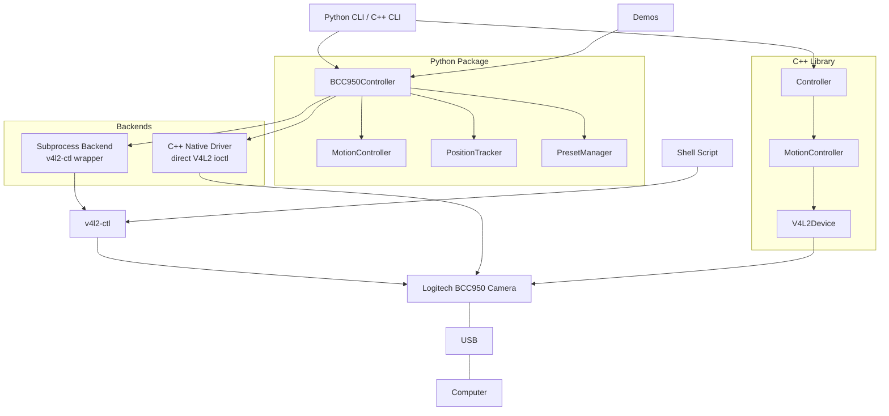

# Logitech BCC950 Camera Control


Control the Logitech BCC950 ConferenceCam's pan, tilt, and zoom functions via Python, C++, or shell commands on Linux.

## About the Logitech BCC950

The Logitech BCC950 ConferenceCam is a versatile videoconferencing device that combines excellent video quality with motorized pan, tilt, and zoom capabilities. This unique combination makes it not just an ordinary webcam, but a fully controllable camera that can be programmatically directed to look around a room.

### Key Features

- **Full HD Video**: 1080p at 30fps
- **Motorized Pan/Tilt**: 180° pan and tilt, controllable via software
- **Digital Zoom**: Up to 4x zoom (1.2x in HD)
- **Built-in Audio**: Full-duplex speakerphone with noise cancellation
- **USB Plug-and-Play**: Linux, Windows, macOS
- **Programmable Controls**: Full API access to PTZ functions

## Project Structure

```
logitech_bcc950/
├── src/
│   ├── cpp/                    # C++ driver (direct V4L2 ioctl)
│   │   ├── include/bcc950/     # Headers
│   │   ├── src/                # Implementation
│   │   └── tests/              # Google Test suite
│   ├── python/                 # Python package
│   │   ├── bcc950/             # Library modules
│   │   └── tests/              # pytest suite (unit/integration/vision)
│   └── bindings/               # pybind11 native backend (55x faster)
├── demos/
│   ├── basic_embodied.py       # Simple see/hear/think/speak AI demo
│   ├── vision/                 # OpenCV-based demos (tracker, calibration)
│   └── voice/                  # Whisper STT / Piper TTS demos
├── samples/                    # Quick-start scripts (PTZ, video stream)
├── scripts/                    # Setup scripts, hardware verify
├── docs/                       # Architecture, vision testing, future plans
└── CMakeLists.txt              # Top-level build (C++ + optional pybind11)
```

## System Architecture



## Quick Start

### Automated Setup (Recommended)

```bash
# One command sets up everything: packages, venv, AI models, hardware test
./scripts/setup.sh
source .venv/bin/activate

# Verify hardware works (camera physically moves)
python scripts/verify_hardware.py

# Generate visual HTML report
python scripts/generate_report.py
```

### Python CLI

```bash
source .venv/bin/activate

# Control the camera
bcc950 --pan-left
bcc950 --tilt-up --duration 0.5
bcc950 --zoom-value 300
bcc950 --move -1 1 1.0    # pan left + tilt up for 1 second

# Presets
bcc950 --save-preset "desk"
bcc950 --recall-preset "desk"
bcc950 --list-presets
```

### Python API

```python
from bcc950 import BCC950Controller

camera = BCC950Controller()

# Basic controls
camera.pan_left(duration=0.5)
camera.tilt_up(duration=0.3)
camera.zoom_to(300)

# Combined movement
camera.move(pan_dir=-1, tilt_dir=1, duration=1.0)

# Presets
camera.save_preset("meeting_view")
camera.recall_preset("meeting_view")

# Position tracking
print(camera.position)  # estimated pan/tilt/zoom
```

### C++ Build

```bash
cd src/cpp
mkdir build && cd build
cmake ..
make -j$(nproc)

# Run CLI
./bcc950 --pan-left --duration 0.5

# Run tests
ctest -v
```

### Shell Script

```bash
./scripts/bcc950_control.sh --pan-left
./scripts/bcc950_control.sh --zoom-in
./scripts/bcc950_control.sh --demo
```

## Testing

```bash
# Python unit tests (no hardware needed)
cd src/python
pip install -e ".[test]"
pytest -v

# Integration tests (requires camera)
pytest --run-hardware --device /dev/video0 -v

# Vision verification tests (requires camera + OpenCV)
pip install -e ".[test,vision]"
pytest --run-hardware --run-vision --device /dev/video0 -v

# C++ unit tests (no hardware needed)
cd src/cpp/build
cmake .. && make -j && ctest -v
```

### Vision Test Methodology

The vision tests use computer vision to verify camera movements:

| Test | Algorithm | Pass Criteria |
|------|-----------|---------------|
| Pan L/R | Lucas-Kanade sparse flow | median dx > 3px, 70% directional consistency |
| Tilt U/D | Lucas-Kanade sparse flow | median dy > 3px, 70% directional consistency |
| Zoom in | ORB feature distance ratio | ratio > 1.05 |
| Zoom out | ORB feature distance ratio | ratio < 0.95 |
| Any move | Frame differencing | mean pixel diff > 5.0 |

See [docs/vision_testing.md](docs/vision_testing.md) for details.

## Demos

### Basic Embodied AI

A simple see/hear/think/speak loop — BCC950 camera + YOLO tracking + Whisper STT + Piper TTS:

```bash
source .venv/bin/activate
python demos/basic_embodied.py
python demos/basic_embodied.py --no-tts --no-tracking --whisper-model base
```

For the **full AI Commander** (autonomous consciousness with sensorium, thinking thread,
persistent memory, and multi-sensor fusion), see [TRITIUM-SC](https://github.com/mvalancy/tritium-sc).

### Vision Demos

```bash
source .venv/bin/activate

# Track moving objects automatically
python demos/vision/motion_tracker.py

# Interactive movement verifier with optical flow overlay
python demos/vision/movement_verifier.py

# Calibrate position estimation with ArUco markers
python demos/vision/calibration.py
```

### Voice Demos

```bash
source .venv/bin/activate

# Voice-controlled camera
python demos/voice/voice_control.py

# AI-narrated camera (Ollama vision)
python demos/voice/narrator.py --use-ollama

# Classic narrator (Haar cascades, no AI needed)
python demos/voice/narrator.py
```

See [demos/README.md](demos/README.md) for detailed setup and [docs/usage_scenarios.md](docs/usage_scenarios.md) for comprehensive guides.

## Documentation

- [Setup Guide](docs/setup_guide.md) - Complete installation and configuration guide
- [Usage Scenarios](docs/usage_scenarios.md) - Detailed guides for each usage mode
- [Architecture](docs/architecture.md) - Component design, data flow, backend selection
- [Vision Testing](docs/vision_testing.md) - CV methodology, thresholds, interpretation
- [LLM Integration](docs/lua_llm_integration.md) - Lua bindings + LLM tool-use schema

## Contributing

Contributions are welcome! Feel free to submit pull requests or create issues.

## License

MIT License - see [LICENSE](LICENSE) for details.
