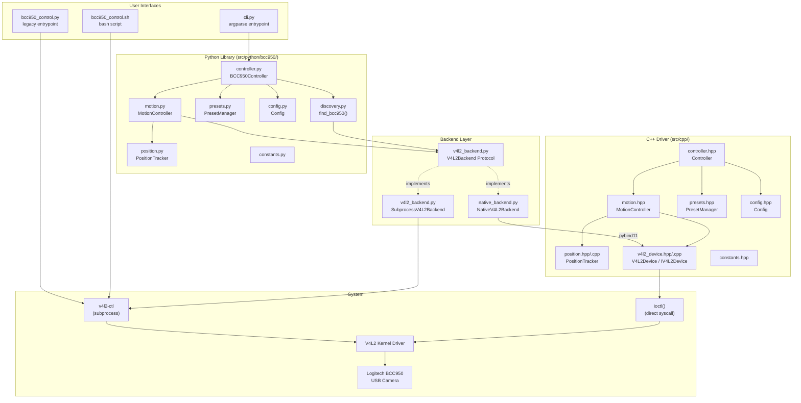
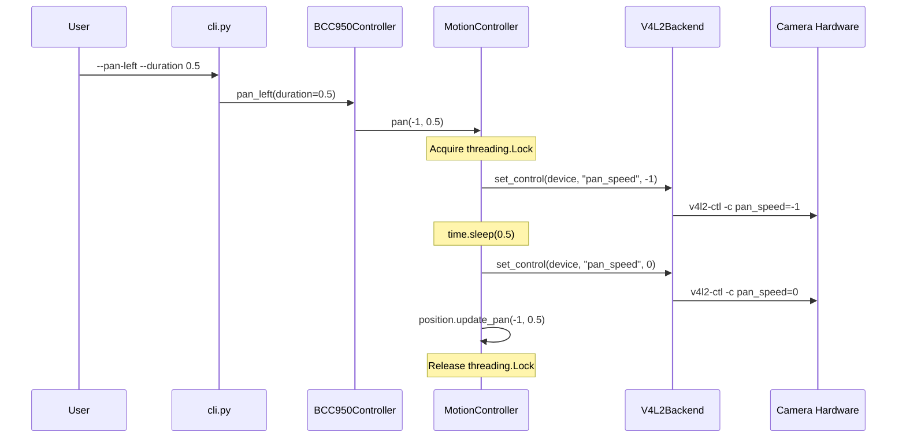
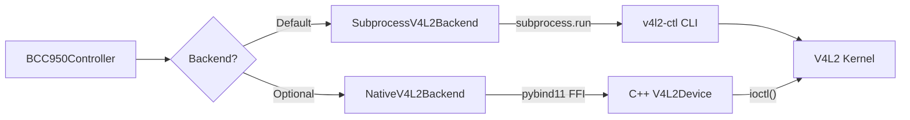
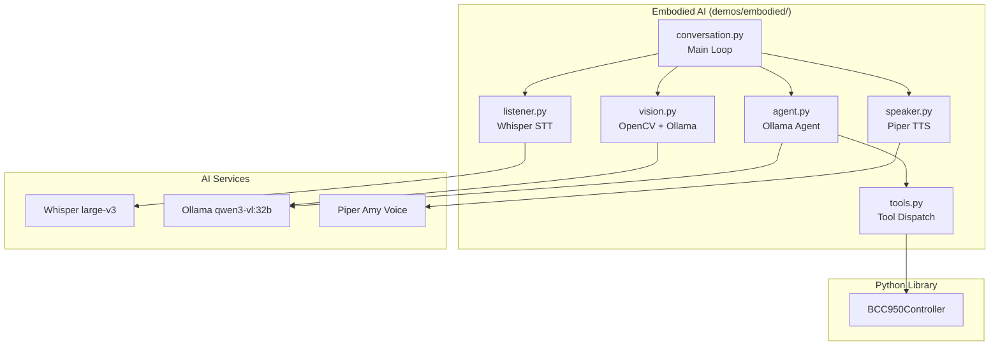
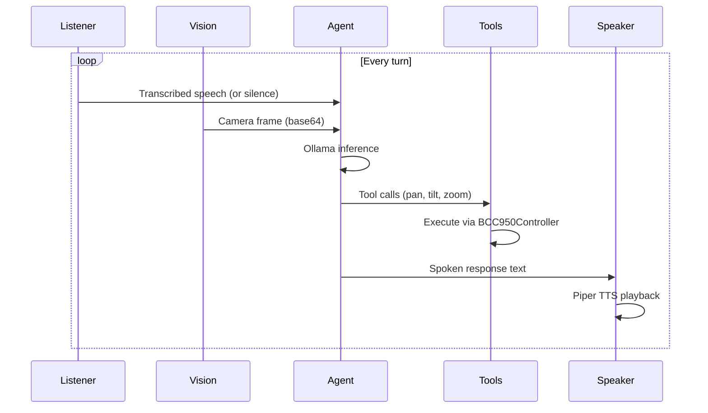

# BCC950 Architecture

## Component Diagram



## Data Flow



## Module Descriptions

### Python Package (`src/python/bcc950/`)

| Module | Responsibility |
|--------|---------------|
| `controller.py` | High-level facade. Wires together Config, MotionController, PresetManager, and discovery. Provides both the backward-compatible API (`pan_left()`, `zoom_in()`) and the new API (`move()`, `zoom_to()`, `save_preset()`). |
| `motion.py` | Thread-safe motion primitives. Every movement acquires a mutex, sets the speed, sleeps for the requested duration, then stops. Updates the PositionTracker after each move. |
| `position.py` | Estimated position tracking via a `@dataclass`. Accumulates `speed * duration` for pan/tilt since the BCC950 has no absolute pan/tilt readback. Zoom is tracked as an absolute value (100-500). |
| `presets.py` | JSON-file-based named preset storage. Saves/loads `{name: {pan, tilt, zoom}}` entries to `~/.bcc950_presets.json`. |
| `config.py` | Key=value config file management (`~/.bcc950_config`). Stores device path, pan speed, tilt speed, and zoom step. File format is compatible with bash `source`. |
| `v4l2_backend.py` | Defines the `V4L2Backend` protocol (Python `Protocol` class) and the `SubprocessV4L2Backend` implementation that shells out to `v4l2-ctl` using list args (no `shell=True`). |
| `native_backend.py` | Optional pybind11 wrapper around the C++ `V4L2Device`. Gracefully falls back if `_bcc950_native` is not importable. Caches device handles per path. |
| `discovery.py` | Auto-detects BCC950 by parsing `v4l2-ctl --list-devices` output for "BCC950", falling back to scanning `/dev/video*` for `pan_speed` support. |
| `cli.py` | `argparse`-based CLI. Registered as the `bcc950` console script in `pyproject.toml`. |
| `constants.py` | Shared numeric constants: zoom range (100-500), speed limits (-1/+1), default durations, file names, estimated position ranges. |

### C++ Driver (`src/cpp/`)

| Header/Source | Responsibility |
|--------------|---------------|
| `v4l2_device.hpp/.cpp` | Direct V4L2 ioctl interface. Opens the device with `O_RDWR | O_NONBLOCK`, uses `VIDIOC_S_CTRL` / `VIDIOC_G_CTRL` / `VIDIOC_QUERYCTRL`. Defines `IV4L2Device` abstract interface for dependency injection and `V4L2Device` concrete implementation. Non-copyable, movable, RAII file descriptor management. |
| `controller.hpp` | High-level `Controller` class mirroring the Python `BCC950Controller` API. Owns a `unique_ptr<IV4L2Device>`, composes MotionController, Config, PresetManager, and PositionTracker. |
| `motion.hpp` | Thread-safe motion control using `std::mutex`. Same start-sleep-stop pattern as Python. Takes a non-owning `IV4L2Device*` pointer. |
| `position.hpp/.cpp` | `PositionTracker` struct with `update_pan()`, `update_tilt()`, `update_zoom()`, `distance_to()`, `reset()`. Uses `std::clamp()`. |
| `presets.hpp` | JSON preset storage with hand-written serialization (no external JSON library dependency). Returns `std::optional<PositionTracker>` on recall. |
| `config.hpp` | Key=value config compatible with the Python format. Uses `std::map<string, string>` internally. |
| `constants.hpp` | Maps to Linux `V4L2_CID_*` control IDs directly. Same numeric values as the Python constants. |

## Backend Selection

The Python library supports two backend implementations behind the `V4L2Backend` protocol:



**SubprocessV4L2Backend** (default):
- Shells out to `v4l2-ctl` via `subprocess.run()` with list arguments (no `shell=True`).
- Requires `v4l2-utils` package installed on the system.
- Higher latency per call due to process spawn overhead.
- Simpler to set up -- no compilation needed.

**NativeV4L2Backend** (optional):
- Wraps the C++ `V4L2Device` class through pybind11 bindings.
- Requires building with `BUILD_PYTHON_BINDINGS=ON`.
- Lower latency -- direct `ioctl()` calls, no process overhead.
- Caches device file descriptors per path in `_device_handles`.
- Falls back gracefully: `native_backend.is_available()` returns `False` if the C extension is not installed.

To use the native backend:

```python
from bcc950.native_backend import NativeV4L2Backend, is_available
from bcc950.controller import BCC950Controller

if is_available():
    ctrl = BCC950Controller(backend=NativeV4L2Backend())
```

## Config and Presets File Locations

| File | Default Path | Format | Shared between Python/C++ |
|------|-------------|--------|--------------------------|
| Config | `~/.bcc950_config` | Key=value plain text | Yes -- `source`-able by bash |
| Presets | `~/.bcc950_presets.json` | JSON object | Yes -- same schema |

**Config file example** (`~/.bcc950_config`):
```
DEVICE=/dev/video2
PAN_SPEED=1
TILT_SPEED=1
ZOOM_STEP=10
```

**Presets file example** (`~/.bcc950_presets.json`):
```json
{
  "home": {
    "pan": 0.0,
    "tilt": 0.0,
    "zoom": 100
  },
  "whiteboard": {
    "pan": 2.5,
    "tilt": 1.0,
    "zoom": 300
  }
}
```

Both paths can be overridden via constructor arguments to `BCC950Controller` (Python) or `Controller` (C++).

## Embodied AI Architecture

The embodied AI demo (`demos/embodied/`) adds a conversational layer on top of the camera control system:



### Conversation Flow



## Thread Safety

The `MotionController` (both Python and C++ implementations) uses a mutex to ensure that each movement's start-sleep-stop sequence is atomic:

1. **Lock acquired** before setting the speed control.
2. **Sleep** for the requested duration while the motor runs.
3. **Speed set to 0** to stop the motor.
4. **Position tracker updated** with the movement delta.
5. **Lock released**.

This guarantees that concurrent callers (e.g., a voice command thread and a vision tracking thread) will not interleave their start/stop sequences, which could leave the motor running indefinitely.

**What is protected:** Individual movement primitives (`pan()`, `tilt()`, `combined_move()`, `zoom_absolute()`, `zoom_relative()`, `stop()`).

**What is not protected:** Sequences of multiple movements at the `BCC950Controller` level (e.g., `reset_position()` calls `pan()` four times sequentially). If you need atomic multi-step sequences, acquire your own external lock or coordinate at the application level.

**PositionTracker** itself is not thread-safe -- it is only mutated while the MotionController mutex is held, so no additional synchronization is needed for normal use. If you read position from another thread while a movement is in progress, you may see a stale value.
