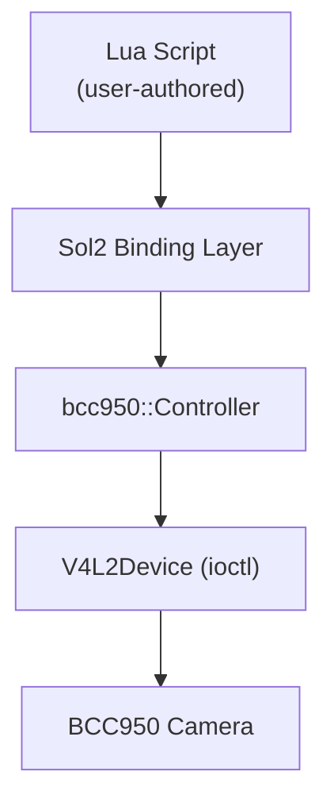
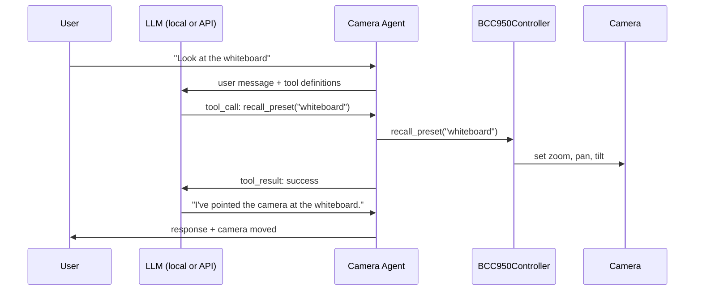
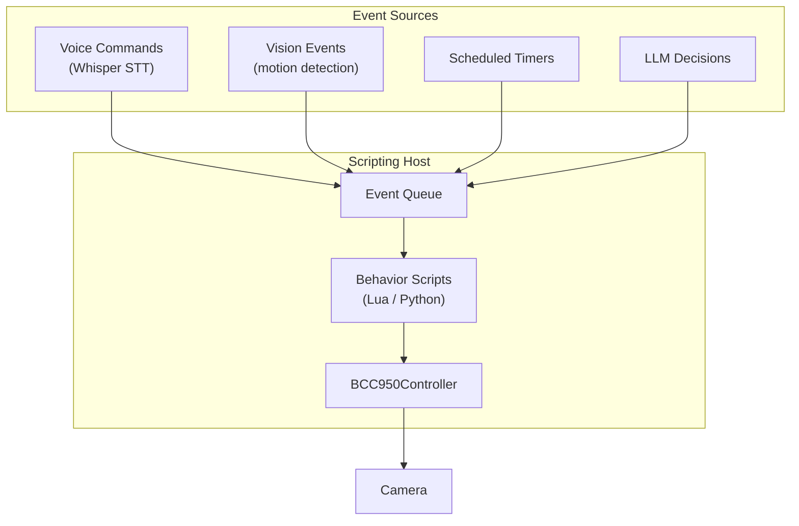

# Lua and LLM Integration -- Future Design Notes

## Overview

This document outlines the planned integration of Lua scripting and LLM tool-use capabilities with the BCC950 camera control system. The goal is to enable autonomous camera behaviors driven by scripts and AI models that can call camera functions as structured tools.

## Lua Bindings via Sol2

### Architecture

The C++ driver will expose its API to Lua through the [Sol2](https://github.com/ThePhD/sol2) header-only library, which provides type-safe bindings between C++ and Lua 5.4.



### Binding Design

The Lua API will mirror the C++ `Controller` interface:

```cpp
// src/cpp/lua/bcc950_lua.cpp

#include <sol/sol.hpp>
#include "bcc950/controller.hpp"

sol::state create_lua_state() {
    sol::state lua;
    lua.open_libraries(sol::lib::base, sol::lib::math, sol::lib::os);

    // Register PositionTracker
    lua.new_usertype<bcc950::PositionTracker>("PositionTracker",
        "pan",  &bcc950::PositionTracker::pan,
        "tilt", &bcc950::PositionTracker::tilt,
        "zoom", &bcc950::PositionTracker::zoom,
        "reset", &bcc950::PositionTracker::reset,
        "distance_to", &bcc950::PositionTracker::distance_to
    );

    // Register Controller
    lua.new_usertype<bcc950::Controller>("Controller",
        // Movement
        "pan_left",  &bcc950::Controller::pan_left,
        "pan_right", &bcc950::Controller::pan_right,
        "tilt_up",   &bcc950::Controller::tilt_up,
        "tilt_down", &bcc950::Controller::tilt_down,
        "zoom_in",   &bcc950::Controller::zoom_in,
        "zoom_out",  &bcc950::Controller::zoom_out,
        "move",      &bcc950::Controller::move,
        "zoom_to",   &bcc950::Controller::zoom_to,
        "stop",      &bcc950::Controller::stop,
        "reset_position", &bcc950::Controller::reset_position,

        // Presets
        "save_preset",   &bcc950::Controller::save_preset,
        "recall_preset", &bcc950::Controller::recall_preset,
        "delete_preset", &bcc950::Controller::delete_preset,
        "list_presets",  &bcc950::Controller::list_presets,

        // Info
        "get_zoom",        &bcc950::Controller::get_zoom,
        "has_ptz_support", &bcc950::Controller::has_ptz_support,
        "position",
            sol::property(&bcc950::Controller::position)
    );

    return lua;
}
```

### Example Lua Script

```lua
-- patrol.lua: sweep between two preset positions

local cam = Controller.new("/dev/video2")

cam:save_preset("left_wall")
cam:pan_right(2.0)
cam:save_preset("right_wall")

-- Patrol loop
while true do
    cam:recall_preset("left_wall")
    os.execute("sleep 5")
    cam:recall_preset("right_wall")
    os.execute("sleep 5")
end
```

### Build Integration

Lua and Sol2 will be optional CMake targets:

```cmake
option(BUILD_LUA_BINDINGS "Build Lua scripting support" OFF)

if(BUILD_LUA_BINDINGS)
    find_package(Lua 5.4 REQUIRED)
    add_library(bcc950_lua SHARED src/lua/bcc950_lua.cpp)
    target_link_libraries(bcc950_lua PRIVATE bcc950 ${LUA_LIBRARIES})
    target_include_directories(bcc950_lua PRIVATE
        ${LUA_INCLUDE_DIR}
        third_party/sol2/include
    )
endif()
```

## LLM Tool-Use Schema

### Concept

LLMs with function-calling (tool-use) capabilities can control the camera by emitting structured JSON tool calls. The application layer parses these calls and dispatches them to the `BCC950Controller`.



### Tool Definitions

These tool definitions follow the OpenAI function-calling schema and work with any compatible LLM API (OpenAI, Anthropic, Ollama with compatible models).

```json
{
  "tools": [
    {
      "type": "function",
      "function": {
        "name": "pan_camera",
        "description": "Pan the camera left or right for a specified duration.",
        "parameters": {
          "type": "object",
          "properties": {
            "direction": {
              "type": "string",
              "enum": ["left", "right"],
              "description": "Direction to pan."
            },
            "duration": {
              "type": "number",
              "description": "How long to pan in seconds (0.1 to 5.0).",
              "default": 0.3
            }
          },
          "required": ["direction"]
        }
      }
    },
    {
      "type": "function",
      "function": {
        "name": "tilt_camera",
        "description": "Tilt the camera up or down for a specified duration.",
        "parameters": {
          "type": "object",
          "properties": {
            "direction": {
              "type": "string",
              "enum": ["up", "down"],
              "description": "Direction to tilt."
            },
            "duration": {
              "type": "number",
              "description": "How long to tilt in seconds (0.1 to 5.0).",
              "default": 0.3
            }
          },
          "required": ["direction"]
        }
      }
    },
    {
      "type": "function",
      "function": {
        "name": "set_zoom",
        "description": "Set the camera zoom to an absolute value. Range is 100 (widest) to 500 (most zoomed in).",
        "parameters": {
          "type": "object",
          "properties": {
            "value": {
              "type": "integer",
              "minimum": 100,
              "maximum": 500,
              "description": "Absolute zoom value."
            }
          },
          "required": ["value"]
        }
      }
    },
    {
      "type": "function",
      "function": {
        "name": "move_camera",
        "description": "Combined pan and tilt movement. Specify direction as -1, 0, or 1 for each axis.",
        "parameters": {
          "type": "object",
          "properties": {
            "pan_dir": {
              "type": "integer",
              "enum": [-1, 0, 1],
              "description": "-1 for left, 0 for none, 1 for right."
            },
            "tilt_dir": {
              "type": "integer",
              "enum": [-1, 0, 1],
              "description": "-1 for down, 0 for none, 1 for up."
            },
            "duration": {
              "type": "number",
              "description": "Movement duration in seconds.",
              "default": 0.3
            }
          },
          "required": ["pan_dir", "tilt_dir"]
        }
      }
    },
    {
      "type": "function",
      "function": {
        "name": "recall_preset",
        "description": "Move the camera to a previously saved named position.",
        "parameters": {
          "type": "object",
          "properties": {
            "name": {
              "type": "string",
              "description": "Name of the preset to recall."
            }
          },
          "required": ["name"]
        }
      }
    },
    {
      "type": "function",
      "function": {
        "name": "save_preset",
        "description": "Save the camera's current position as a named preset for later recall.",
        "parameters": {
          "type": "object",
          "properties": {
            "name": {
              "type": "string",
              "description": "Name for the preset."
            }
          },
          "required": ["name"]
        }
      }
    },
    {
      "type": "function",
      "function": {
        "name": "get_camera_status",
        "description": "Get the camera's current estimated position (pan, tilt, zoom) and list of saved presets.",
        "parameters": {
          "type": "object",
          "properties": {}
        }
      }
    },
    {
      "type": "function",
      "function": {
        "name": "reset_camera",
        "description": "Reset the camera to its default center position with minimum zoom.",
        "parameters": {
          "type": "object",
          "properties": {}
        }
      }
    }
  ]
}
```

### Tool Dispatch Implementation

```python
# Example tool dispatcher for LLM function calls

from bcc950 import BCC950Controller

def dispatch_tool_call(controller: BCC950Controller, name: str, args: dict) -> dict:
    """Execute a tool call and return the result."""

    if name == "pan_camera":
        duration = args.get("duration", 0.3)
        if args["direction"] == "left":
            controller.pan_left(duration)
        else:
            controller.pan_right(duration)
        return {"status": "ok", "action": f"panned {args['direction']} for {duration}s"}

    elif name == "tilt_camera":
        duration = args.get("duration", 0.3)
        if args["direction"] == "up":
            controller.tilt_up(duration)
        else:
            controller.tilt_down(duration)
        return {"status": "ok", "action": f"tilted {args['direction']} for {duration}s"}

    elif name == "set_zoom":
        controller.zoom_to(args["value"])
        return {"status": "ok", "zoom": args["value"]}

    elif name == "move_camera":
        controller.move(args["pan_dir"], args["tilt_dir"], args.get("duration", 0.3))
        return {"status": "ok"}

    elif name == "recall_preset":
        found = controller.recall_preset(args["name"])
        return {"status": "ok" if found else "not_found", "preset": args["name"]}

    elif name == "save_preset":
        controller.save_preset(args["name"])
        return {"status": "ok", "preset": args["name"]}

    elif name == "get_camera_status":
        pos = controller.position
        return {
            "pan": pos.pan,
            "tilt": pos.tilt,
            "zoom": pos.zoom,
            "presets": controller.list_presets(),
        }

    elif name == "reset_camera":
        controller.reset_position()
        return {"status": "ok"}

    return {"status": "error", "message": f"Unknown tool: {name}"}
```

## Scripting Architecture for Autonomous Camera Behaviors

### Behavior Script Model

Camera behaviors are defined as scripts (Lua or Python) that run in a loop and react to external events. The scripting host provides the camera controller and an event queue.



### Example Behaviors

**Meeting tracker** -- follow the active speaker:
```lua
-- meeting_tracker.lua
function on_event(event)
    if event.type == "speaker_change" then
        local preset = event.speaker_name
        if cam:recall_preset(preset) then
            log("Switched to " .. preset)
        else
            log("No preset for " .. preset .. ", staying put")
        end
    end
end
```

**Idle patrol** -- scan the room when no activity is detected:
```lua
-- idle_patrol.lua
local idle_timeout = 30  -- seconds
local last_activity = os.time()

function on_event(event)
    if event.type == "motion_detected" or event.type == "speech_detected" then
        last_activity = os.time()
        cam:stop()
        return
    end

    if os.time() - last_activity > idle_timeout then
        -- Slow sweep
        cam:pan_right(1.0)
        cam:pan_left(2.0)
        cam:pan_right(1.0)
    end
end
```

## Integration Patterns with Local LLMs

### Ollama

[Ollama](https://ollama.com/) runs open-weight LLMs locally. Models with tool-use support (e.g., Llama 3, Mistral, Qwen) can emit structured function calls.

```python
import ollama

SYSTEM_PROMPT = """You control a Logitech BCC950 PTZ camera.
You can pan left/right, tilt up/down, zoom in/out, and manage presets.
Use the provided tools to control the camera based on user instructions.
Always confirm what you did after executing a tool call."""

def camera_agent(user_input: str, controller: BCC950Controller):
    response = ollama.chat(
        model="llama3.1",
        messages=[
            {"role": "system", "content": SYSTEM_PROMPT},
            {"role": "user", "content": user_input},
        ],
        tools=load_tool_definitions(),  # The JSON schema from above
    )

    if response.message.tool_calls:
        for call in response.message.tool_calls:
            result = dispatch_tool_call(
                controller,
                call.function.name,
                call.function.arguments,
            )
            # Feed result back to the model for confirmation
```

### Key Design Considerations

**Latency:** Each tool call involves an LLM inference round-trip plus motor actuation time (~0.1-5s). For real-time tracking, use direct CV-based control rather than LLM-in-the-loop.

**Safety constraints:** Limit movement durations in the tool schema (max 5.0s) and enforce zoom bounds (100-500) at the controller level. The controller already clamps all values.

**Statelessness:** LLMs do not inherently remember camera state between turns. Always include `get_camera_status` in the tool set so the model can query the current position before deciding on movements.

**Multi-step planning:** For tasks like "scan the entire room and describe what you see," the LLM will need to issue multiple tool calls in sequence. Structure the agent loop to support iterative tool-call / tool-result exchanges until the model produces a final text response.
