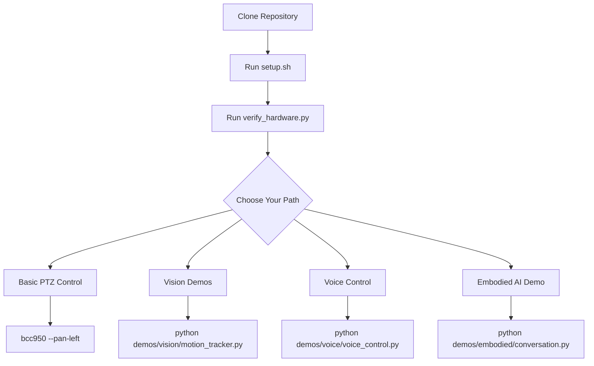

# BCC950 Setup Guide

Complete guide to setting up the Logitech BCC950 camera control system, from basic PTZ to the full embodied AI demo.

## Quick Path



## Prerequisites

| Requirement | Purpose | Check |
|------------|---------|-------|
| Ubuntu 22.04+ / Debian 12+ | OS | `cat /etc/os-release` |
| Python 3.10+ | Runtime | `python3 --version` |
| Logitech BCC950 | Camera | `lsusb \| grep Logitech` |
| USB connection | Camera link | `ls /dev/video*` |
| Ollama (optional) | AI models | `ollama --version` |
| NVIDIA GPU (optional) | AI acceleration | `nvidia-smi` |

## Step 1: Clone and Setup

```bash
git clone https://github.com/yourusername/logitech_bcc950.git
cd logitech_bcc950
./scripts/setup.sh
```

The setup script runs 8 phases:

1. **System packages** - v4l-utils, portaudio, ffmpeg, alsa-utils
2. **Python venv** - Creates `.venv/` in project root
3. **Python packages** - OpenCV, NumPy, Whisper, sounddevice
4. **bcc950 package** - Installs in editable mode
5. **Piper TTS** - Downloads binary + Amy voice model
6. **Ollama models** - Pulls qwen3-vl:32b vision model
7. **Permissions** - Adds user to video group
8. **Hardware verification** - Tests PTZ and audio

Each phase is idempotent (safe to re-run).

## Step 2: Activate Environment

```bash
source .venv/bin/activate
```

## Step 3: Verify Hardware

```bash
python scripts/verify_hardware.py
```

This runs a PTZ choreography (pan left/right, tilt up/down, zoom in/out) and captures a test frame to `/tmp/bcc950_test.jpg`.

## Step 4: Generate System Report

```bash
python scripts/generate_report.py
```

Opens an HTML report in your browser showing pass/fail for every component.

## Device Permissions

If you see "Permission denied" for `/dev/video*`:

```bash
# Add yourself to the video group
sudo usermod -aG video $USER

# Log out and back in, then verify
groups | grep video
```

For persistent udev rules:

```bash
echo 'SUBSYSTEM=="video4linux", ATTRS{idVendor}=="046d", ATTRS{idProduct}=="0837", MODE="0666"' | \
  sudo tee /etc/udev/rules.d/99-bcc950.rules
sudo udevadm control --reload-rules
```

## Troubleshooting

### Camera not detected

```bash
# Check USB connection
lsusb | grep Logitech

# List video devices
v4l2-ctl --list-devices

# Check controls on a specific device
v4l2-ctl -d /dev/video0 --list-ctrls
```

### PTZ controls not found

The BCC950 exposes multiple `/dev/video*` devices. The PTZ controls are typically on the first one. Try each:

```bash
for dev in /dev/video*; do
    echo "=== $dev ==="
    v4l2-ctl -d "$dev" --list-ctrls 2>/dev/null | grep -E "pan|tilt|zoom" || echo "  (no PTZ)"
done
```

### Audio issues

```bash
# List ALSA recording devices
arecord -l

# Test recording (1 second)
arecord -D hw:2,0 -d 1 -f S16_LE -r 16000 /tmp/test.wav
aplay /tmp/test.wav
```

### Whisper model download

Whisper models download on first use. For the large-v3 model (~3GB):

```bash
python -c "import whisper; whisper.load_model('large-v3')"
```

### Ollama not responding

```bash
# Check if Ollama is running
systemctl status ollama

# Start it
systemctl start ollama

# Or run directly
ollama serve &
```
