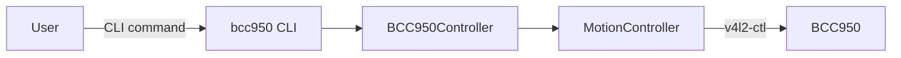
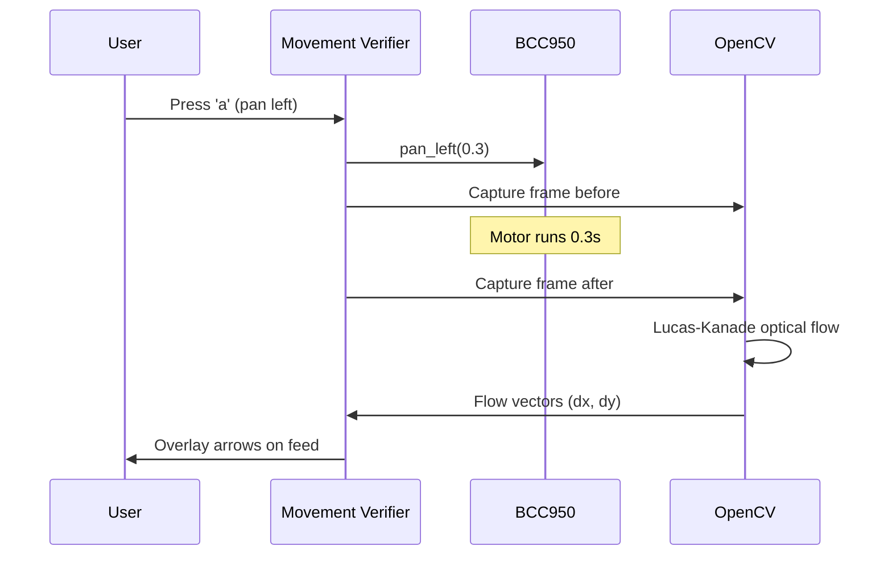
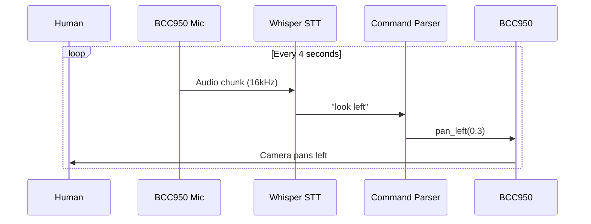
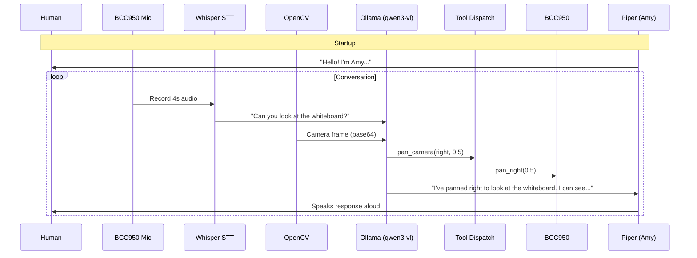
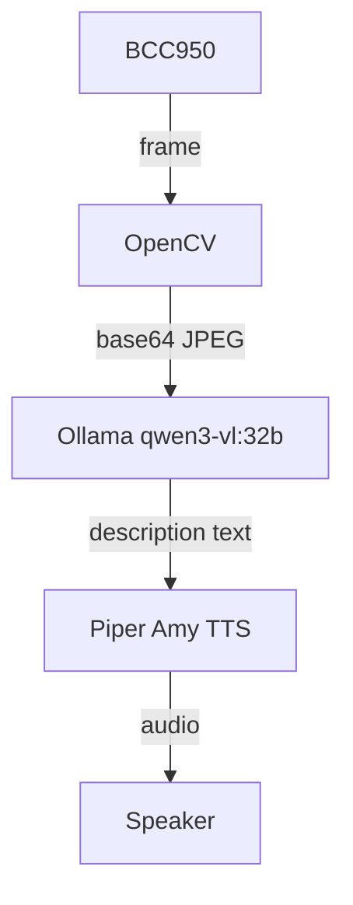
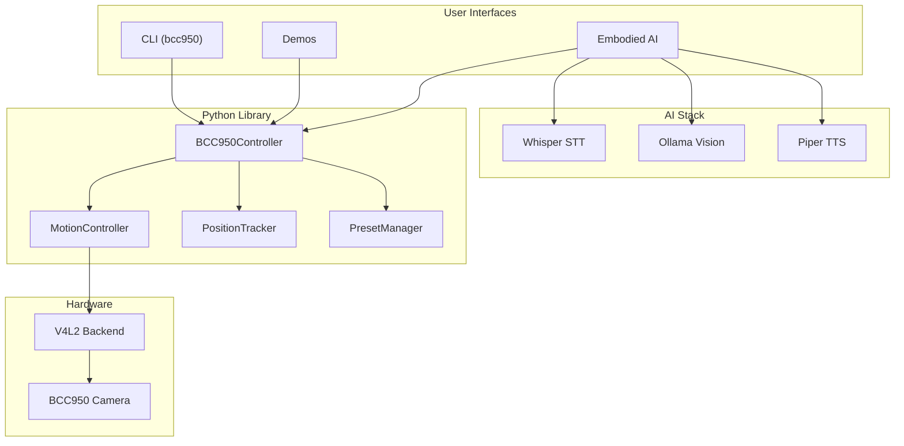

# Usage Scenarios

Detailed guides for each way to use the BCC950 camera system.

## 1. Basic PTZ Control

Direct camera control via CLI or Python API.



### CLI Usage

```bash
source .venv/bin/activate

# Single movements
bcc950 --pan-left
bcc950 --pan-right --duration 0.5
bcc950 --tilt-up
bcc950 --zoom-value 300

# Combined movement
bcc950 --move -1 1 1.0    # pan left + tilt up for 1s

# Presets
bcc950 --save-preset "desk"
bcc950 --recall-preset "desk"
bcc950 --list-presets

# Info
bcc950 --info
bcc950 --list
bcc950 --reset
```

### Python API

```python
from bcc950 import BCC950Controller

cam = BCC950Controller()
cam.find_camera()          # Auto-detect BCC950

cam.pan_left(0.5)          # Pan left for 0.5s
cam.tilt_up(0.3)           # Tilt up for 0.3s
cam.zoom_to(300)           # Zoom to 300/500
cam.move(-1, 1, 1.0)       # Combined: pan left + tilt up

cam.save_preset("view1")   # Save position
cam.recall_preset("view1") # Return to saved position
print(cam.position)        # Show estimated position
cam.reset_position()       # Reset to center
```

**Prerequisites**: v4l-utils, bcc950 package
**Setup time**: 2 minutes

---

## 2. Vision-Verified Movement

Use OpenCV to confirm the camera actually moved by analyzing optical flow.



### Run

```bash
source .venv/bin/activate

# Interactive PTZ with live optical flow
python demos/vision/movement_verifier.py --device /dev/video0

# Motion tracking (auto-follow objects)
python demos/vision/motion_tracker.py --device /dev/video0

# ArUco marker calibration
python demos/vision/calibration.py --device /dev/video0
```

**Controls**: `a/d` pan, `w/s` tilt, `+/-` zoom, `r` reset, `q` quit

**Prerequisites**: OpenCV, NumPy, v4l-utils, bcc950
**Setup time**: 5 minutes

---

## 3. Voice-Controlled Camera

Speak commands and the camera obeys using Whisper STT.



### Run

```bash
source .venv/bin/activate
python demos/voice/voice_control.py

# With options
python demos/voice/voice_control.py --device /dev/video0 --whisper-model base
```

### Supported Commands

| Say this | Camera does |
|---------|-------------|
| "look left" / "pan left" | Pan left |
| "look right" / "pan right" | Pan right |
| "look up" / "tilt up" | Tilt up |
| "look down" / "tilt down" | Tilt down |
| "pan left for 2 seconds" | Timed pan |
| "zoom in" / "zoom out" | Zoom |
| "zoom to 300" | Absolute zoom |
| "reset" / "center" | Reset position |
| "quit" / "exit" | Exit |

**Prerequisites**: Whisper, sounddevice, NumPy, v4l-utils, bcc950
**Setup time**: 10 minutes (Whisper model download)

---

## 4. Embodied AI Conversation (Amy)

Full conversational AI that sees, hears, speaks, and moves.



### Run

```bash
source .venv/bin/activate

# Full demo (requires all components)
python demos/embodied/conversation.py

# With lightweight model
python demos/embodied/conversation.py --model gemma3:4b --whisper-model base

# Text-only (no TTS)
python demos/embodied/conversation.py --no-tts
```

### Architecture

```
conversation.py     Main loop: listen -> see -> think -> act -> speak
  listener.py       Whisper STT (records from BCC950 mic)
  vision.py         OpenCV capture + base64 encoding
  agent.py          Ollama chat with tool definitions
  tools.py          Maps tool calls to BCC950Controller
  speaker.py        Piper TTS with queued playback
```

**Prerequisites**: All of the above + Ollama + Piper TTS
**Setup time**: 30 minutes (model downloads)

---

## 5. AI-Narrated Camera

The camera describes what it sees using an Ollama vision model.



### Run

```bash
source .venv/bin/activate

# AI narration via Ollama vision model
python demos/voice/narrator.py --use-ollama

# With specific model
python demos/voice/narrator.py --use-ollama --model gemma3:4b

# Classic Haar cascade mode (no AI needed)
python demos/voice/narrator.py

# Show video feed with detection overlay
python demos/voice/narrator.py --show
```

**Prerequisites**: OpenCV, Ollama (for --use-ollama), Piper TTS (optional)
**Setup time**: 15 minutes

---

## 6. Development

### Run Tests

```bash
source .venv/bin/activate

# Unit tests (no hardware)
cd src/python && pytest -v

# Hardware integration tests
pytest --run-hardware --device /dev/video0 -v

# Vision verification tests
pytest --run-hardware --run-vision --device /dev/video0 -v

# C++ tests
cd src/cpp && mkdir -p build && cd build
cmake .. && make -j$(nproc) && ctest -v
```

### Generate System Report

```bash
python scripts/generate_report.py
# Opens report.html in browser
```

### Project Architecture


